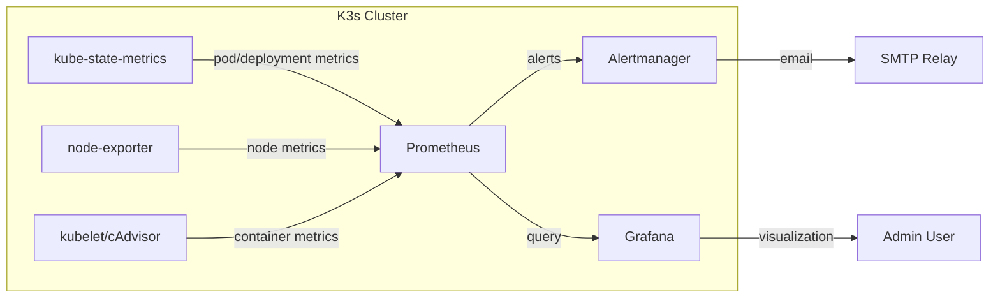

# BB-INFRA - Be Bouncy Infrastructure Repository

## Overview

This repository is the **single source of truth** for deploying and managing all Be Bouncy services in Kubernetes. It contains everything needed to run your applications in the cloud: configuration files, deployment instructions, environment settings, and the GitOps automation that keeps your cluster in sync.

## Why We Built This

Before Docker and Kubernetes, each service was deployed directly on servers using PM2. This caused significant operational friction.

### Before vs. After

| Challenge | Before (PM2 on VPS) | After (Docker + Kubernetes) |
|-----------|---------------------|-------------------------------|
| **Deployment** | Manual SSH commands to each server, prone to human error | Automated via Git push; pipeline handles everything |
| **Environment Consistency** | QA and Production servers often had mismatched Node versions, OS packages | Same container image runs identically everywhere |
| **Rollback** | Manually redeploy previous code version (minutes to hours) | `kubectl rollout undo` in seconds |
| **Secrets Management** | `.env` files scattered across repos, risk of accidental commits | Vault + Kubernetes Secrets, centralized and encrypted |
| **Scaling** | Manual: adjust PM2 instances, restart, repeat | Auto: `kubectl scale` or HPA based on CPU/memory |
| **Resource Isolation** | Services compete for CPU/RAM, one can starve others | Containers have guaranteed resource limits |
| **Failure Recovery** | Process crashes? PM2 restarts it. Machine crashes? Manual intervention | Kubernetes reschedules pods onto healthy nodes automatically |
| **Service Discovery** | Hardcoded IP addresses or load balancer configs | Built-in DNS (service names resolve automatically) |
| **Zero-Downtime Updates** | PM2 reload mode (not always zero downtime) | Rolling updates: old pods terminate gradually as new pods start |
| **Disk Usage** | Each service has its own node_modules | Base images shared, dependencies only in containers |
| **Configuration Drift** | Servers accumulate unique changes over time | Infrastructure as code: everything defined in Git |

### Added Value Summary

| Capability | Value |
|------------|-------|
| **Immutable artifacts** | Images are built once, never changed; deployment is replacing the entire container |
| **Declarative state** | "I want 3 replicas of API" → Kubernetes maintains it indefinitely |
| **Horizontal scaling** | From 1 to 100 replicas with one command |
| **Health self-healing** | Failed container? Kubernetes kills and restarts it automatically |
| **Traffic routing** | Ingress routes external HTTP traffic; Services load-balance internally |
| **Secret injection** | Secrets mounted as files or env vars, never in images |
| **Observability** | Built-in metrics (cAdvisor, metrics-server) + integration with Prometheus/Grafana |

## The Big Picture: How Everything Fits Together

```
Application Code Repositories            CI/CD Pipeline                    Infrastructure Repository                 Kubernetes Clusters
(api, web, ai, microservices)            (GitHub Actions)                   (BB-INFRA)                               (QA and Prod)

┌─────────────────┐                     ┌─────────────────┐               ┌─────────────────┐                       ┌─────────────────┐
│   api repo      │                     │                 │               │                 │                       │                 │
│   (code)        │                     │                 │               │                 │                       │  ArgoCD (QA)    │
└────────┬────────┘                     │                 │               │                 │                       │  watches        │
         │                              │                 │               │                 │                       │  qa/ path       │
         ▼                              │  1. Build image │               │                 │                       └────────┬────────┘
┌─────────────────┐                     │  2. Push to GHCR│               │                 │                                │
│   web repo      │                     │  3. Update      │               │   BB-INFRA      │                       ┌─────────▼─────────┐
│   (code)        │                     │     BB-INFRA    │─────────────▶│   repo          │                       │   QA Cluster      │
└────────┬────────┘                     │                 │               │   (GitOps)      │                       │   (k3s)          │
         │                              │                 │               │                 │                       │  - api-qa        │
         ▼                              │                 │               │                 │                       │  - web-qa        │
┌─────────────────┐                     │                 │               │                 │                       │  - ai-qa         │
│   ai repo       │                     │                 │               │                 │                       │  - microservices-│
│   (code)        │                     │                 │               │                 │                       │    qa            │
└────────┬────────┘                     │                 │               │                 │                       └─────────────────┘
         │                              │                 │               │                 │
         ▼                              │                 │               │                 │                       ┌─────────────────┐
┌─────────────────┐                     │                 │               │                 │                       │  ArgoCD (Prod)  │
│ microservices   │                     │                 │               │                 │                       │  watches        │
│ repo (code)     │                     │                 │               │                 │                       │  prod/ path     │
└────────┬────────┘                     │                 │               │                 │                       └────────┬────────┘
         │                              │                 │               │                 │                                │
         └────────────────────────────▶│  GitHub Actions │               │                 │                       ┌─────────▼─────────┐
                                        │  (CI pipeline)  │               │                 │                       │  Prod Cluster    │
                                        └─────────────────┘               └─────────────────┘                       │  (k3s)           │
                                                                                                                    │  - api-prod      │
                                                                                                                    │  - web-prod      │
                                                                                                                    │  - ai-prod       │
                                                                                                                    │  - microservices-│
                                                                                                                    │    prod          │
                                                                                                                    └─────────────────┘
```

---

## Step 1: Dockerization - From Code to Container

Before Kubernetes can run your applications, each service must be packaged as a **Docker container**. A container is like a lightweight, portable box that contains everything the service needs to run: code, Node.js runtime, dependencies, and configuration.

### The Dockerfile (Multi-Stage Build)

Each repository contains a `Dockerfile` that defines how to build the container image. We use a **two-stage build** to keep the final image small and secure:

```
Stage 1: Builder (node:24-alpine)
┌─────────────────────────────────────────────────────────────┐
│  - Copies package.json and lock files                       │
│  - Installs ALL dependencies (including dev tools)          │
│  - Copies source code                                       │
│  - Runs build (TypeScript compilation, Next.js build, etc.) │
│                                                             │
│  Result: A fully built application with all build tools     │
└─────────────────────────────────────────────────────────────┘
                              │
                              │ (only built artifacts copied)
                              ▼
Stage 2: Production (node:24-alpine)
┌─────────────────────────────────────────────────────────────┐
│  - Copies ONLY production dependencies                      │
│  - Copies built artifacts from Stage 1                      │
│  - Creates a non-root user for security                     │
│  - Sets up health checks                                    │
│  - Defines the start command                                │
│                                                             │
│  Result: A small, secure image (~150-250MB)                 │
└─────────────────────────────────────────────────────────────┘
```

**Why this matters**: Without multi-stage builds, production images include compilers, test frameworks, and other tools that are not needed to run the application. This makes images larger (800MB+) and increases security risks. Multi-stage builds produce images that are 70-80% smaller.

### Security Hardening in Dockerfiles

Each Dockerfile includes several security practices:

| Practice                  | Implementation                                                                                            |
|---------------------------|-----------------------------------------------------------------------------------------------------------|
| **Non-root user**         | The container runs as `appuser`, not root. If compromised, the attacker doesn't have full system access.  |
| **Read-only filesystem**  | The application code is mounted as read-only. Only specific directories (like `/app/logs`) are writable.  |
| **Health checks**         | Kubernetes can monitor if the container is alive and restart it if unhealthy.                             |
| **Minimal base image**    | Using `node:24-alpine` (Alpine Linux) instead of full Ubuntu reduces the attack surface.                  |

### The .dockerignore File

Just like `.gitignore`, the `.dockerignore` file tells Docker which files to exclude when building the image. This prevents:
- `node_modules` from being copied (they are reinstalled inside the container)
- `.env` files with secrets from accidentally being baked into the image
- Git history, logs, and temporary files

### Container Images Registry (GHCR)

Once built, container images are pushed to **GitHub Container Registry (GHCR)**. Each image is tagged with:
- A **short commit SHA** (e.g., `a1b2c3d`) - unique and immutable
- `latest` - always points to the most recent build on the main branch

Example image address: `ghcr.io/be-bouncy-wwd/api:a1b2c3d`

---

## Step 2: Kubernetes - Running Containers at Scale

Kubernetes (k3s in our case) is a container orchestration platform. Think of it as an operating system for your containers. It decides:
- Which machine (node) should run each container
- How many copies (replicas) of each container should run
- How to restart containers if they crash
- How to route network traffic to the right containers

### Our Kubernetes Cluster Architecture

For **QA**, we have a single-node cluster (one physical/virtual machine). For **Production**, we have a three-node cluster (one control plane + two workers) for high availability.

```
Cluster (QA)
 │
 └── Node (b2-7-rbx-a)
      │
      ├── Pod: api-qa
      │    └── Container: api (port 3005)
      │
      ├── Pod: web-qa
      │    └── Container: web (port 4000)
      │
      ├── Pod: ai-qa
      │    └── Container: ai (port 3006)
      │
      └── Pod: microservices-qa
           └── Container: microservices (port 3007)
```

**What is a Pod?** A Pod is the smallest deployable unit in Kubernetes. It typically contains one container (like our services), but can contain multiple tightly-coupled containers.

**What is a Node?** A Node is a machine (virtual or physical) where Pods run. Our QA cluster has one node; Production has three.

---

## Step 3: BB-INFRA - The Infrastructure Repository

This repository is the control center for your Kubernetes clusters. It does NOT contain application code. Instead, it contains **instructions** for Kubernetes on how to run your applications.

### Repository Structure

```
BB-INFRA/
│
├── charts/                          # Helm chart templates (like blueprints)
│   ├── api/                         # Blueprint for deploying API
│   │   ├── Chart.yaml               # Chart metadata (name, version)
│   │   ├── values.yaml              # Default configuration
│   │   └── templates/               # Kubernetes YAML templates
│   │       ├── deployment.yaml      # How to run the container
│   │       ├── service.yaml         # How to expose the container (networking)
│   │       └── ingress.yaml         # How to route external traffic
│   ├── web/                         # Same structure for Web
│   ├── ai/                          # Same structure for AI
│   └── microservices/               # Same structure for Microservices
│
├── environments/                    # Environment-specific settings
│   ├── qa/                          # QA environment values
│   │   ├── values-api.yaml          # QA settings for API (image tag, replicas, etc.)
│   │   ├── values-web.yaml
│   │   ├── values-ai.yaml
│   │   └── values-microservices.yaml
│   └── prod/                        # Production environment values
│       ├── values-api.yaml
│       ├── values-web.yaml
│       ├── values-ai.yaml
│       └── values-microservices.yaml
│
├── argocd/                          # ArgoCD application definitions
│   ├── qa/                          # What ArgoCD should deploy to QA
│   │   ├── root-app.yaml            # The "app of apps" - deploys all services
│   │   ├── api-app.yaml             # Deploys API to QA
│   │   ├── web-app.yaml             # Deploys Web to QA
│   │   ├── ai-app.yaml              # Deploys AI to QA
│   │   └── microservices-app.yaml   # Deploys Microservices to QA
│   └── prod/                        # What ArgoCD should deploy to Production
│       ├── root-app.yaml
│       ├── api-app.yaml
│       ├── web-app.yaml
│       ├── ai-app.yaml
│       └── microservices-app.yaml
│
└── scripts/                         # Helper scripts
    └── deploy.sh                    # Manual deployment helper
```

### What is Helm?

Helm is a **template engine for Kubernetes**. Instead of writing the same YAML file multiple times with small changes, you write a template once and fill in the specific values for each environment.

**Example**: The `deployment.yaml` template for API looks like this (simplified):

```yaml
apiVersion: apps/v1
kind: Deployment
metadata:
  name: {{ .Values.name }}
spec:
  replicas: {{ .Values.replicas }}
  template:
    spec:
      containers:
      - name: {{ .Values.name }}
        image: {{ .Values.image.repository }}:{{ .Values.image.tag }}
        ports:
        - containerPort: {{ .Values.service.port }}
```

Then for QA, you provide `values-api.yaml`:
```yaml
name: api-qa
replicas: 1
image:
  repository: ghcr.io/be-bouncy-wwd/api
  tag: "a1b2c3d"
service:
  port: 3005
```

Helm combines the template with the values to generate the final Kubernetes YAML.

### What is in Each Template?

| Template | Purpose |
|----------|---------|
| **deployment.yaml** | Tells Kubernetes: which container image to run, how many copies (replicas), resource limits (CPU/memory), environment variables, health check settings |
| **service.yaml** | Creates a stable network endpoint for the Pod. Pods can be deleted and recreated (their IP changes), but the Service IP remains constant. |
| **ingress.yaml** | Routes external traffic (from the internet) to the Service. For QA, this creates URLs like `api.qa.bebouncy.com`. |
| **serviceaccount.yaml** | Defines what permissions the Pod has to interact with the Kubernetes API (if needed). |

---

## Step 4: ArgoCD - GitOps Automation

ArgoCD is a Kubernetes controller that continuously monitors your Git repository and ensures your cluster matches what's in Git.

### How ArgoCD Works

```
┌─────────────────────────────────────────────────────────────────┐
│                         BB-INFRA Git Repo                       │
│                    (single source of truth)                     │
└─────────────────────────────────────────────────────────────────┘
                              │
                              │ ArgoCD polls every 3 minutes
                              │ 
                              ▼
┌─────────────────────────────────────────────────────────────────┐
│                          ArgoCD (QA)                            │
│                                                                 │
│  1. Reads argocd/qa/root-app.yaml                               │
│  2. Finds child apps: api-app.yaml, web-app.yaml, etc.          │
│  3. For each child app:                                         │
│     a. Runs `helm template` with the chart + environment values │
│     b. Compares generated YAML with what's running in cluster   │
│     c. If different, syncs the cluster to match                 │
│                                                                 │
└─────────────────────────────────────────────────────────────────┘
                              │
                              │ sync
                              ▼
┌─────────────────────────────────────────────────────────────────┐
│                         QA Cluster                              │
│                    (actual running resources)                   │
└─────────────────────────────────────────────────────────────────┘
```

### The "App of Apps" Pattern

In `argocd/qa/root-app.yaml`, we define an ArgoCD Application whose sole purpose is to deploy other Applications:

```yaml
apiVersion: argoproj.io/v1alpha1
kind: Application
metadata:
  name: bebouncy-qa-root
spec:
  source:
    path: argocd/qa          # Look in this folder
    repoURL: https://github.com/BE-BOUNCY-WWD/BB-INFRA.git
    targetRevision: main
  syncPolicy:
    automated:
      prune: true            # Delete resources that are removed from Git
      selfHeal: true         # If someone manually changes the cluster, revert it
```

When ArgoCD sees this root app, it:
1. Reads every YAML file in `argocd/qa/` folder
2. Creates each one as an ArgoCD Application
3. Each child app then deploys its respective Helm chart

### What Happens When You Push to BB-INFRA?

```
Developer updates BB-INFRA
        │
        ▼
Git push (e.g., updates values-api.yaml with new image tag)
        │
        ▼
ArgoCD detects the change (polling every 3 minutes or via webhook)
        │
        ▼
ArgoCD runs `helm template` with the new values
        │
        ▼
ArgoCD sees that the generated YAML differs from the cluster
        │
        ▼
ArgoCD applies the changes to the cluster
        │
        ▼
Kubernetes starts new Pods with the new image
        │
        ▼
Old Pods are terminated
        │
        ▼
New version is live
```

---

## Step 5: CI Pipeline - From Code Change to Deployment

The CI pipeline is triggered when you push code to any application repository (api, web, ai, microservices). It runs in GitHub Actions.

### Pipeline Architecture

```
Developer pushes code to api repository
        │
        ▼
┌─────────────────────────────────────────────────────────────────┐
│                    GitHub Actions (CI Pipeline)                 │
├─────────────────────────────────────────────────────────────────┤
│                                                                 │
│  JOB 1: Security Scan (security-scan-source)                    │
│  ├── Checkout code                                              │
│  ├── Install dependencies                                       │
│  ├── Run Trivy filesystem scan (secrets, vulnerabilities)       │
│  └── Fail if critical/high issues found                         │
│                                                                 │
│  JOB 2: Build and Push (build-and-push)                         │
│  ├── Install dependencies                                       │
│  ├── Run unit tests                                             │
│  ├── Build Docker image using multi-stage Dockerfile            │
│  ├── Tag image with commit SHA (e.g., a1b2c3d)                  │
│  ├── Push image to GHCR                                         │
│  ├── Run Trivy container scan                                   │
│  └── Send Slack notification (success/failure)                  │
│                                                                 │
│  JOB 3: Update Infrastructure (update-infra-qa)                 │
│  ├── Checkout BB-INFRA repository                               │
│  ├── Update values-{service}.yaml with new image tag            │
│  ├── Commit and push change to BB-INFRA                         │
│  └── Send Slack notification                                    │
│                                                                 │
└─────────────────────────────────────────────────────────────────┘
        │
        ▼
BB-INFRA updated with new image tag
        │
        ▼
ArgoCD detects change and syncs cluster
```

### What Each Pipeline Job Does

| Job | Purpose | When It Runs |
|-----|---------|--------------|
| **security-scan-source** | Scans source code for secrets, vulnerable dependencies, and misconfigurations | On every push to branch |
| **build-and-push** | Builds the Docker image, runs tests, pushes to GHCR | On every push to branch |
| **update-infra-qa** | Updates BB-INFRA with the new image tag | Only on success, and only for QA environment |

### Why Update BB-INFRA from the Pipeline?

ArgoCD only watches BB-INFRA. It does NOT watch your application repositories. This is intentional and follows the GitOps pattern:

- **Separation of concerns**: Application repos manage code; infrastructure repo manages deployments
- **Auditability**: Every deployment change is a commit in BB-INFRA with a clear message
- **Rollback**: To revert to a previous version, you revert the commit in BB-INFRA
- **Access control**: You can restrict who can approve production changes

---

## Step 6: Production Promotion (Controlled Deployments)

For Production, we use a more controlled process:

```
QA pipeline finishes successfully (image built, tested)
        │
        ▼
Developer (or CI) triggers `workflow_dispatch` with `environment: prod`
        │
        ▼
Pipeline runs `update-infra-prod` job
        │
        ▼
Instead of directly committing to BB-INFRA/main, it:
├── Creates a new branch in BB-INFRA
├── Updates values-prod.yaml with the new image tag
├── Opens a Pull Request
└── Sends Slack notification
        │
        ▼
Team reviews and approves the PR
        │
        ▼
PR is merged to main
        │
        ▼
ArgoCD (Prod) detects change and syncs
```

This ensures that production deployments are:
- **Reviewed** before going live
- **Auditable** (who approved which version)
- **Reversible** (revert the PR)

---

## Summary: The Complete Workflow

```
1. Developer pushes code to api repository
         │
2. GitHub Actions triggers CI pipeline
         │
3. Pipeline builds image → runs tests → pushes to GHCR
         │
4. Pipeline updates BB-INFRA/qa/values-api.yaml with new image tag
         │
5. ArgoCD (QA) detects change in BB-INFRA
         │
6. ArgoCD syncs QA cluster to use new image
         │
7. Developer verifies QA is working
         │
8. Developer triggers production promotion (workflow_dispatch with env=prod)
         │
9. Pipeline creates PR in BB-INFRA to update production values
         │
10. Team reviews and merges PR
         │
11. ArgoCD (Prod) detects change and syncs production cluster
         │
12. New version is live in production
```
---

## Rollback Strategy (GHCR + GitOps)

Rollback in our system is **safe, fast, and GitOps-driven**. Instead of manually redeploying code, we simply change the **Docker image tag** in `BB-INFRA`, and **ArgoCD automatically applies the rollback**.

### Key Idea

All deployed versions of your services are stored as **Docker images in GHCR (GitHub Container Registry)**.

Each image is identified by:

* a **mutable tag** (like `latest`, `v2.66.0`)
* an **immutable commit SHA** (like `0ebcf74`)

⚠️ Important:

* Tags like `latest` or even `v2.66.0` can change over time
* The **only reliable and exact version** is the **image SHA**

### How to Find a Version to Rollback

1. Go to GHCR packages:

   ```
   https://github.com/orgs/BE-BOUNCY-WWD/packages
   ```

2. Open the `api` package

3. You will see a list of images with:

   * Tags (`latest`, `v2.x.x`)
   * Corresponding **commit SHA**

4. Copy the **7-character SHA** of the version you want to paste it in target tag (Rollback pipeline) 

### How Rollback Works

When you trigger the rollback pipeline:

1. You provide:

   * environment (`qa` or `prod`)
   * target tag (⚠️ this should be the SHA)

2. The pipeline:

   * Verifies the image exists in GHCR
   * Updates the correct file
   * Commits & pushes to `BB-INFRA`

3. ArgoCD:

   * Detects the change
   * Syncs the cluster
   * Deploys the selected version

---

### ✅ What You Should Use

| Goal                                     | What to Use                                     |
| ---------------------------------------- | ----------------------------------------------- |
| Rollback to a **specific exact version** | ✅ Use the **7-character SHA** (e.g., `0ebcf74`) |
| Rollback to a version like `v2.66.0`     | ⚠️ Avoid — tag may have changed                 |
| Rollback to any known build              | ✅ Use the SHA from GHCR                         |
| Just deploy latest version               | ⚠️ Use `latest` (not stable, changes over time) |

### ⚠️ Important Notes

* **SHA = immutable → safest rollback option**
* **Tags = mutable → not guaranteed**
* Always prefer SHA for production rollback 🚨

### 💡 In One Sentence

Rollback = **pick a previous image SHA from GHCR → update BB-INFRA → ArgoCD redeploys automatically**


```
You (Developer)
   │
   │ 1. Go to GHCR (Packages)
   │    → Find desired version
   │    → Copy image SHA (e.g., 0ebcf74)
   ▼
Trigger Rollback Pipeline (GitHub Actions)
   │
   │ 2. Input:
   │    - environment (qa/prod)
   │    - target_tag = SHA
   ▼
Pipeline Execution
   │
   │ 3. Validate:
   │    - Check SHA exists in GHCR
   │    - Prod requires confirmation
   ▼
Update BB-INFRA (GitOps)
   │
   │ 4. Modify:
   │    environments/<env>/values-api.yaml
   │    tag: "0ebcf74"
   │
   │ 5. Commit & Push
   ▼
ArgoCD
   │
   │ 6. Detect change (auto-sync)
   ▼
Kubernetes Cluster
   │
   │ 7. Pull image with SHA
   │    → Replace running pods
   ▼
✅ Rolled back version is LIVE

```

# Monitoring & Observability Implementation for BeBouncy QA Cluster

## Overview

A complete monitoring stack was deployed on the K3s QA cluster to provide real-time visibility into cluster health, application performance, and resource utilization. The stack consists of three integrated components:

- **Prometheus** – Metrics collection and time-series storage
- **Alertmanager** – Alert routing, grouping, and notification delivery  
- **Grafana** – Visualization dashboards and metric exploration

The entire stack is managed as code through ArgoCD, with all configuration stored in the `BB-INFRA` Git repository, following GitOps principles.

---

## Architecture

### Component Interaction



### Prometheus Operator

The stack is deployed using the **Prometheus Operator** (`kube-prometheus-stack` Helm chart), which simplifies management of Prometheus, Alertmanager, and their associated monitoring resources (ServiceMonitors, PrometheusRules, etc.) through Kubernetes custom resources.

---

## Prometheus Configuration

### Resource Limits & Retention

Given the QA environment's resource constraints, Prometheus was configured with conservative limits:

| Parameter | Value | Justification |
|-----------|-------|---------------|
| `retention` | 3 days | Balance between historical data and disk usage |
| `retentionSize` | 7GB | Upper bound on disk consumption |
| `scrapeInterval` | 45s | Reduced frequency to lower load |
| `evaluationInterval` | 45s | Alert evaluation cadence |

**Resource allocation:**
```yaml
resources:
  requests:
    memory: "300Mi"
    cpu: "150m"
  limits:
    memory: "600Mi"
    cpu: "500m"
```

### Storage

Persistent storage is configured using K3s `local-path` provisioner with an 8Gi PVC, ensuring metrics survive pod restarts while respecting disk space limits.

### Collection Targets

Prometheus scrapes metrics from the following sources:

| Target | Purpose | Scrape Interval |
|--------|---------|-----------------|
| **kubelet/cAdvisor** | Container CPU/memory/network metrics | 45s |
| **kube-state-metrics** | Kubernetes object state (pods, deployments, etc.) | 45s |
| **node-exporter** | Node-level disk, CPU, memory, network | 45s |
| **kube-api-server** | API server performance | 45s |
| **coreDNS** | DNS resolution metrics | 45s |

---

## Alertmanager Configuration

### SMTP & Email Routing

Email alerts are sent via **OVH SMTP relay** (`ssl0.ovh.net:465`) to `emna@bebouncy.com`. Authentication uses a secret-mounted password file for security.

```yaml
global:
  smtp_smarthost: "ssl0.ovh.net:465"
  smtp_from: "emna@bebouncy.com"
  smtp_auth_username: "emna@bebouncy.com"
  smtp_auth_password_file: /etc/alertmanager/secrets/smtp-password/password
  smtp_require_tls: false
```

### Routing & Grouping

Alerts are grouped by `alertname` and `namespace` to reduce notification spam:

| Parameter | Value | Effect |
|-----------|-------|--------|
| `group_wait` | 20s | Wait before sending first notification |
| `group_interval` | 2m | Wait before sending new alerts in same group |
| `repeat_interval` | 12h | Minimum time before resending the same alert |

### Custom Email Format

Email subject lines include status and alert name for quick triage:

```
Subject: [{{ .Status | toUpper }}] QA — {{ .GroupLabels.alertname }}
Example: [FIRING] QA — PodCrashLooping
```

### Inhibition Rules

Critical alerts inhibit warning alerts for the same `alertname` and `namespace` to prevent notification flooding when a severe issue already exists.

### Receivers

| Receiver | Purpose |
|----------|---------|
| `email-alerts` | Sends alerts to team email |
| `null` | Drops `Watchdog` alerts (internal Prometheus health check) |

---

## Grafana Dashboards

Grafana provides a centralized visualization layer with two key dashboards:

### 1. Node Exporter Full (ID: 1860)

A standard community dashboard providing comprehensive node-level metrics:
- CPU usage per core and overall
- Memory utilization (used, available, cached, buffered)
- Disk usage and I/O statistics
- Network throughput and errors
- System load averages

### 2. Custom Dashboard: "Be Bouncy — K3s QA Cluster"

A purpose-built dashboard with five logical sections:

| Section | Panels | Metrics Displayed |
|---------|--------|-------------------|
| **Cluster Overview** | 6 stat panels | Nodes ready, pods running, CPU %, memory %, disk %, deployments available |
| **Node Resource Usage** | 3 time-series | CPU %, memory %, disk % over time per node |
| **QA Namespace Services** | 2 time-series | Pod-level CPU (cores) and memory (bytes) for all QA services |
| **All Namespaces** | 2 time-series | CPU and memory usage aggregated by namespace |
| **Workload State** | 2 tables | Deployment availability (available vs desired) and pod restart counts |

### Dashboard Access

Grafana is accessible at `http://91.134.98.188:31000` (NodePort) with admin credentials stored securely. No persistent storage is configured for Grafana (dashboards are provisioned via ConfigMap), reducing resource footprint.

---

## Custom Alerting Rules

In addition to the default Prometheus rules, custom alerts were defined to reflect Be Bouncy's specific operational requirements:

### Node-Level Alerts

| Alert | Condition | Severity | Action |
|-------|-----------|----------|--------|
| `NodeHighCPU` | CPU > 85% for 3min | Warning | Email notification |
| `NodeHighMemory` | Memory > 85% for 3min | Warning | Email notification |
| `NodeDiskPressure` | Disk > 80% for 2min | Warning | Email notification |

### Kubernetes Workload Alerts

| Alert | Condition | Severity | Action |
|-------|-----------|----------|--------|
| `PodCrashLooping` | Any restart in 15min | Critical | Immediate email |
| `PodNotReady` | Pod in Pending/Unknown/Failed | Warning | Email notification |
| `DeploymentReplicasMismatch` | Available < desired for 3min | Critical | Immediate email |

---

## GitOps Integration

### Helm Chart Structure

The monitoring stack is deployed through BB-INFRA as a standard Helm chart:

```
BB-INFRA/charts/monitoring/
├── Chart.yaml
└── templates/
    └── PrometheusRule.yaml
```

### ArgoCD Application

Two ArgoCD applications manage the monitoring stack:

1. **`monitoring-qa`** – Deploys the `kube-prometheus-stack` Helm chart with QA-specific values
2. **`monitoring-rules-qa`** – Deploys custom PrometheusRule resources

This separation allows independent updates to the chart version and custom alert rules.

### Configuration Management

All monitoring configuration is stored in `environments/qa/values-monitoring.yaml`, including:
- Prometheus retention, resource limits, and storage
- Alertmanager SMTP settings, routing, and receivers
- Grafana dashboard provisioning and resource allocation

---

## Resource Optimization

Given the QA node's resources, the stack is deliberately lean:

| Component | Request | Limit | Notes |
|-----------|---------|-------|-------|
| Prometheus | 300Mi | 600Mi | Conservative memory, 3-day retention |
| Alertmanager | 64Mi | 128Mi | Minimal footprint |
| Grafana | 100Mi | 200Mi | No persistent storage, dashboards from ConfigMap |
| Prometheus Operator | 64Mi | 128Mi | Single replica |
| kube-state-metrics | 50Mi | 100Mi | Essential for object state |
| node-exporter | 30Mi | 60Mi | DaemonSet overhead minimal |

**Total allocated requests:** ~608Mi (excluding node-exporter per-node overhead)

---

## Operational Workflow

### Normal Operation

1. Prometheus scrapes metrics every 45 seconds
2. Alert rules evaluate every 45 seconds
3. Healthy state → no alerts → no emails
4. Team views dashboards for proactive monitoring

### Alert Condition

1. Metric violates threshold (e.g., CPU > 85%)
2. Prometheus fires alert after `for` duration (prevents flapping)
3. Alertmanager groups with other alerts (20s group_wait)
4. Email sent with subject `[FIRING] QA — AlertName`
5. Alert appears in Alertmanager UI

### Resolution

1. Condition returns to normal
2. Prometheus auto-resolves alert (no manual action)
3. Email sent with `[RESOLVED]` in subject (`send_resolved: true`)
4. Alert removed from UI after 5 days (retention)

---

## Testing & Validation

### Test Alert

A test alert was successfully triggered to validate end-to-end delivery:

```bash
curl -X POST http://localhost:9093/api/v2/alerts \
  -H "Content-Type: application/json" \
  -d '[{"labels":{"alertname":"TestAlert","severity":"critical"},"annotations":{"summary":"Test email"},"startsAt":"...","endsAt":"..."}]'
```

**Results:**
- Alert appeared in Alertmanager UI
- Email received in `emna@bebouncy.com` inbox
- Subject correctly formatted as `[FIRING] QA — TestAlert`
- Resolution email sent after `endsAt`

### Stress Test

A CPU stress pod (`busybox` infinite loop) was deployed to trigger `PodCrashLooping`:
1. Alert fired after 2 minutes of continuous restarts
2. Email received with pod name and namespace
3. Pod deleted → alert resolved automatically
4. Resolution email received

```
